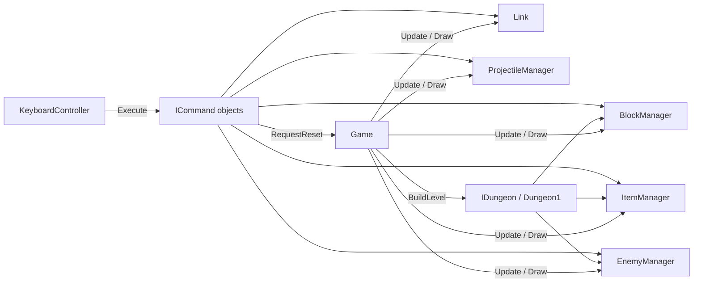

# Sprint 2 Design Document

This document explains how the Sprint 2 game framework is put together: what each major component does, which design patterns it uses, and how it talks to the rest of the game. Sprint 2 is a non-interactive framework: every object draws, moves, animates and changes state, but nothing collides with anything else yet.

## Overview

Each frame, `Game.Update` first polls the controllers, which run the commands bound to the pressed keys. Then it updates every manager and Link. `Game.Draw` asks each of them to draw into one shared `SpriteBatch`.

| Pattern | Where it is used |
|---|---|
| Command | Every key action is an `ICommand` stored in a key → command dictionary |
| State | Link's behavior is split into `IPlayerState` classes |
| Factory | `BlockFactory`, `ItemFactory`, `ProjectileFactory`, `EnemyFactory` create objects and own the sprite sheet coordinates |
| Template method / inheritance | `AbstractEnemy` → `PatrolEnemy` / `WaitingPatrolEnemy` / `WanderingEnemy` → concrete enemies |

---

## 1. Core loop and level loading (`Byte/Core`)

**What it does.** `Game` owns the MonoGame loop, the `SpriteBatch`, the controllers and one manager per object category. `GameAssets` loads every texture once and exposes it through a singleton. `GameConstants` holds shared values such as the window size, the background color and Link's start position.

**Level loading.** `Game` builds no objects itself. It takes an `IDungeon` (currently `Dungeon1`), which creates the block, item and enemy managers with their starting contents and positions. Adding another dungeon later means writing another `IDungeon`; `Game` does not change.

**Reset (`R`).** `BuildLevel()` creates everything in the level from scratch: it asks the dungeon for new managers, creates a new projectile manager and a new `Link`, and rebuilds all keybindings so every command points at the new objects. `ResetCommand` calls `Game.RequestReset()`, which only sets a flag; `Update` runs `BuildLevel()` after the controllers finish. This avoids changing the keybinding dictionary while `KeyboardController` is still looping over it. No object state is kept in static fields, so nothing survives a reset.

**Resizing.** Everything is drawn in a fixed 1600×1600 virtual space. When the window changes size, `OnClientSizeChanged` rebuilds a scale-and-translate matrix that is passed to `SpriteBatch.Begin`, so the game keeps its aspect ratio at any window size.

## 2. Input handling (`Byte/Controller`, `Byte/Command`)

**Pattern: Command.** `KeyboardController` holds a `Dictionary<Keys, ICommand>`. Each frame it looks up every bound key that is down and calls `Execute(GameTime)` on its command. The controller knows nothing about Link, enemies or blocks, and commands know nothing about the keyboard. Changing a key binding is a one-line change in `Game.BuildLevel()`.

**Press-only keys.** Some actions should run once per key press rather than every frame while the key is held (`E`, `R`, `O`, `P`). The controller keeps a set of these keys and runs their commands only on the frame the key goes down. Other repeatable actions (block/item cycling, using items) space out repeats with a cooldown inside the command.

**Case.** MonoGame reports physical keys, so upper and lower case letters trigger the same binding.

`MouseController` follows the same idea with a `Dictionary<Rectangle, ICommand>` per mouse button; right-clicking inside the window quits.

## 3. Player (`Byte/Player`)

**Pattern: State.** `Link` holds the player's data: position, facing direction, health, damage flag and current sprite. Its behavior lives in its current `IPlayerState`:

| State | Behavior |
|---|---|
| `PlayerIdleState` | Still frame for the facing direction |
| `PlayerMoveUp/Down/Left/RightState` | Two-frame walking animation that follows Link's position |
| `PlayerAttackState` | Four-frame sword swing played once, then back to idle |
| `PlayerUseItemState` | Item-use pose played once, then back to idle |

`Link.Update` and `Link.Draw` forward to the current state. `Link.GetNewState` swaps states and clears the old sprite, so the next state builds its own animation. Attack and use-item set `IsAttacking`, which blocks movement commands until the animation finishes.

**Commands → Link.** Movement commands set Link's direction and speed and switch to the matching move state. `AttackCommand` calls `Link.Attack()`, `UseProjectileCommand` calls `Link.UseItem()`, and `PlayerTakeDamageCommand` calls `Link.TakeDamage()`.

**Damage.** `TakeDamage()` lowers health and starts a 0.5 second timer. While the timer runs, `Link.Update` tints the current sprite red; when it expires the tint is cleared. The tint is applied after the state updates, so it works in every state.

## 4. Sprites (`Byte/Sprite`)

All visuals go through the `ISprite` interface (`Update`, `Draw`, color, flip effects, origin, looping). Implementations:

- `StaticSprite`: one frame at a fixed position.
- `AnimatedSprite`: loops through frames at a fixed position.
- `MovingAnimatedSprite`: frames plus a position that can be moved each frame; supports play-once animations (`Loop = false`, `IsFinished`) and per-frame origins so uneven attack frames stay lined up.

Game objects hold an `ISprite` and decide where it goes and when it changes; the sprite decides how it is drawn. This keeps drawing details out of gameplay logic.

## 5. Blocks (`Byte/Block`)

**Pattern: Factory.** `BlockFactory` is the only class that knows the tile sheet. The tiles sit on a grid (16×16 tiles, 17 px apart), so each `CreateXBlock` method just picks a column and row. There are 11 block classes (square, keystone, two statues, void, speckled floor, water, stairs, brick, ladder, sand). They all extend `AbstractBlock`, which stores a sprite and a position and implements `IBlock`.

`BlockManager` holds the list and draws only the selected block. `NextBlockCommand` / `PreviousBlockCommand` (`Y` / `T`) move the selection with wrap-around. Blocks are stationary and have no interaction.

## 6. Items (`Byte/Item`)

**Pattern: Factory.** `ItemFactory` creates the five pickups (rupee, heart, boomerang, bow, bomb) from the item sheet. Rupee, heart and boomerang use an `AnimatedSprite` that flashes between two colors; bow and bomb use a `StaticSprite`. Every item implements `IItem`.

`ItemManager` works like `BlockManager`: it draws one item at a time, and `NextItemCommand` / `PreviousItemCommand` (`I` / `U`) cycle through them with a short cooldown.

## 7. Projectiles (`Byte/Projectile`)

Every projectile implements `IProjectile` (`Update`, `Draw`, `IsExpired`). `ProjectileManager` updates and draws all live projectiles and removes expired ones each frame, so each projectile class only has to decide when it is done.

| Projectile | Behavior | Expires |
|---|---|---|
| `Arrow` | Flies straight in Link's facing direction | After 700 px or when it leaves the window |
| `Bomb` | Sits for a 1 s fuse, then plays the explosion once | When the explosion animation finishes |
| `Boomerang` | Flies out 450 px, then reverses | When it returns to where it was thrown |
| `Fireball` | Aquamentus's attack; flies in a straight line | After 1200 px or when it leaves the window |

**Pattern: Factory.** `ProjectileFactory` owns all projectile sprite coordinates (Link's sheet for the player's items, the boss sheet for fireballs). `UseProjectileCommand` takes a factory method as a delegate, so one command class handles keys `1`, `2` and `3`: it computes the spawn point in front of Link and adds whatever projectile the delegate creates.

## 8. Enemies (`Byte/Sprite/Enemy`)

**Movement through inheritance.** `AbstractEnemy` holds the position, velocity and sprite. Its `Update` calls the abstract `Move` to pick a velocity, applies it, and clamps the result so the whole sprite stays inside `GameConstants.WINDOW_SIZE`. Subclasses only decide *how* to move:

| Base class | Movement | Used by |
|---|---|---|
| `PatrolEnemy` | Walks between waypoints along cardinal directions | `Stalfos` (square loop, sprite flips every 0.25 s) |
| `WaitingPatrolEnemy` | Same, but pauses at each waypoint | `Gel` (moves, then waits), `Aquamentus` (paces back and forth) |
| `WanderingEnemy` | Heads to random nearby points, picking a new one on arrival (RNG) | `Keese` (also speeds up over its first 2 s) |

Waypoints and wander targets are clamped to the window too, so an enemy never gets stuck pushing against an edge toward a point it cannot reach.

**Boss attack.** `Aquamentus` adds a fire timer: every 2 seconds it creates three fireballs from its mouth in a leftward spread through `ProjectileFactory`. It keeps the fireballs in its own `ProjectileManager`, so they update and draw only while Aquamentus is the enemy on screen.

**Creation.** `EnemyFactory.Create<T>()` is a single generic method that builds any enemy type with its sheet, path and timing settings. `Dungeon1` uses it to define the starting enemies. `EnemyManager` shows exactly one enemy at a time; `NextEnemyCommand` / `PreviousEnemyCommand` (`P` / `O`) cycle with wrap-around.

---

## Known design debt (planned for Sprint 3)

- Link's animation frames and the enemy frames are still defined in the state and enemy classes instead of in a factory, unlike blocks, items and projectiles. Moving them into a sprite factory is the first refactor for Sprint 3.
- There are no shared `IGameObject` / `IDrawable` / `IUpdateable` interfaces yet; each category has its own interface. These will be needed for collision handling in Sprint 3.
- Movement commands still change Link's position directly. Moving that logic into `Link` (for example `Link.Move(direction)`) will make collision easier to add.
