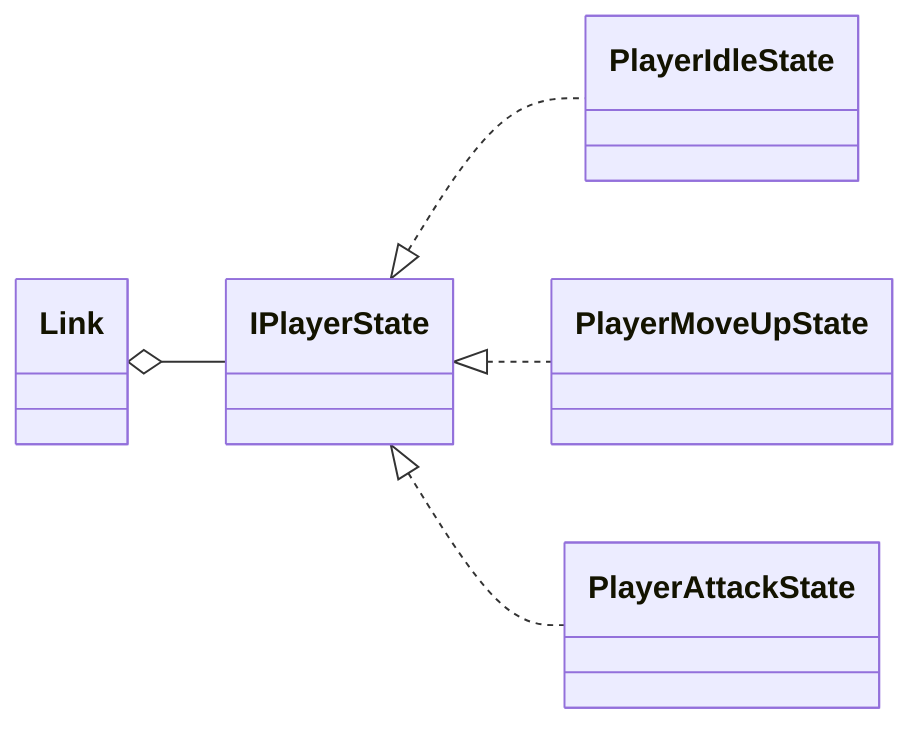

# CSE3902 Project: Interactive Systems
> Group 5, AU2026 @ OSU

### Authors:
- Ayush Saggar (saggar.9@osu.edu) - [Podzied](https://github.com/Podzied)
- Baowen Liu (liu.11884@osu.edu) - [PowerSixxx](https://github.com/PowerSixxx)
- Ethan Singh (singh.2164@osu.edu) - [ethansingh123](https://github.com/ethansingh123)
- Jack Rose (rose.1775@osu.edu) - [Ra4ster](https://github.com/ra4ster)
- Tyler Brown (brown.9452@osu.edu) - [Brownt13487](https://github.com/Brownt13487)

---

## Project Description
This project is a 2D dungeon exploration game framework built in C# using MonoGame. Designed around Agile software development principles, it mimics the mechanics of the original NES Legend of Zelda. The current iteration features a modular entity-component design, a state-machine-driven player character (Link), and extensible interfaces for blocks, enemies, items, and projectiles.

## Controls
**Player Actions**
* **Movement:** `W`, `A`, `S`, `D` (or Arrow Keys)
* **Attack (Sword):** `Z` or `N`
* **Use Item/Projectile:** `1` (Arrow), `2` (Bomb), `3` (Boomerang)
* **Take Damage (Debug):** `E`

**Environment & Debug Cycling**
* **Cycle Blocks:** `T` (Previous), `Y` (Next)
* **Cycle Items:** `U` (Previous), `I` (Next)
* **Cycle Enemies:** `O` (Previous), `P` (Next)

**System Controls**
* **Reset Game:** `R` (Resets player state, blocks, and clears active projectiles)
* **Quit:** `Q`

## Known Bugs
* **Stalfos Sprite Bleed:** Due to the tightly packed nature of the original NES sprite sheet, the Stalfos bounding box may occasionally show 1 pixel of bleed from adjacent sprites.
* **Initial Window Resizing (Windows Only):** The MonoGame viewport may require a manual window resize on the first launch to properly scale the internal `spriteTransform` matrix. 
* *(Add any other specific bugs your team ran into here)*

## Tools & Processes Used
To ensure code quality and maintain performance budgets, our team utilized several external software analysis tools:

1. **Code Metrics (Tokei):** We utilized Tokei to generate comprehensive codebase metrics, including lines of code, blank lines, and comment ratios across our C# files. The raw output is available in our `Documentation/Resources/` directory.
2. **Performance Profiling (dotnet-trace & Speedscope):** We captured runtime execution traces of our game loop using `dotnet-trace`. These traces were exported and visualized as interactive flamegraphs via Speedscope to monitor the CPU cycles spent in our `Update()` and `Draw()` methods.
3. **Roslyn Analyzer:** We also used the built-in diagnostic tools in Visual Studio Community Edition to view heap, memory usage, and CPU/GPU performance overall. Roslyn coupling analysis is a *TODO*.

### Diagnostic Visualizations

## Visualization of Player States

---

> Access CSE3902 resources [here](https://jholewinski.github.io/cse3902/index.html)!